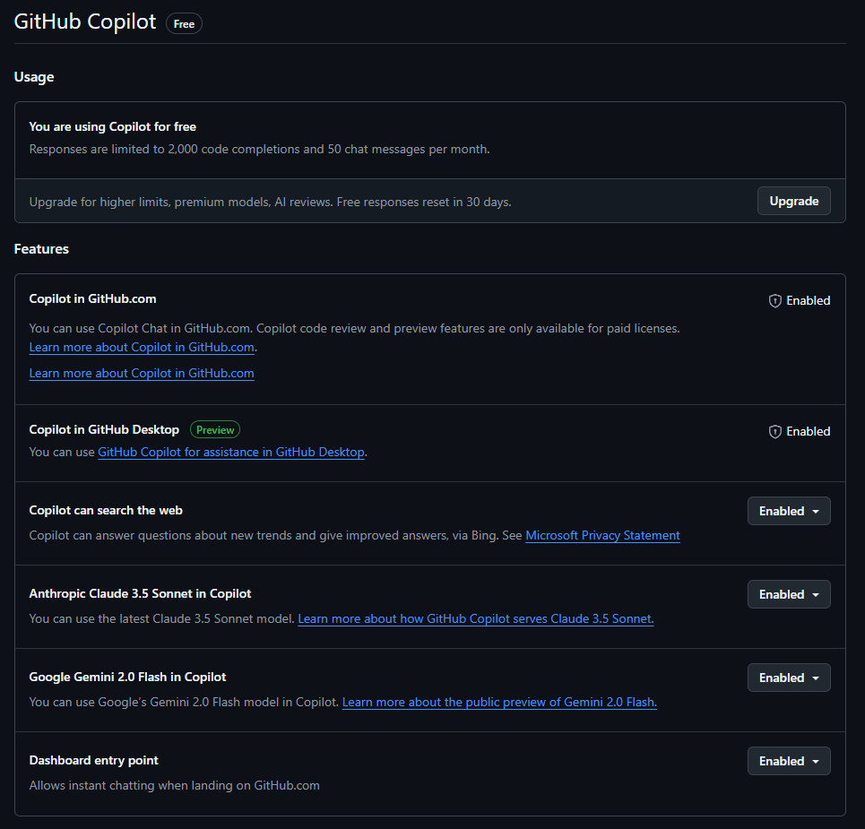
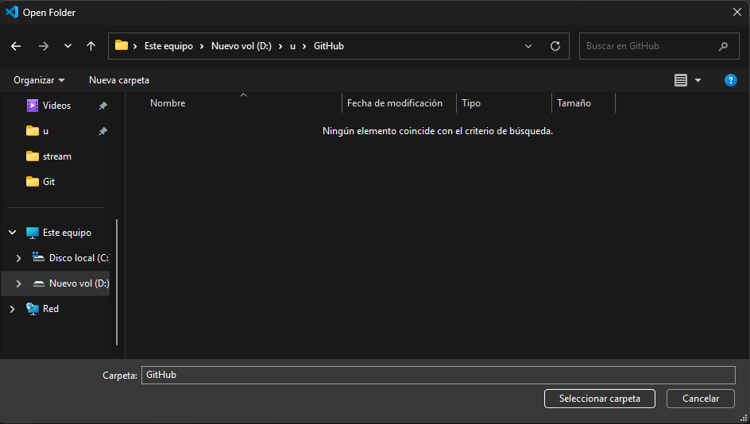
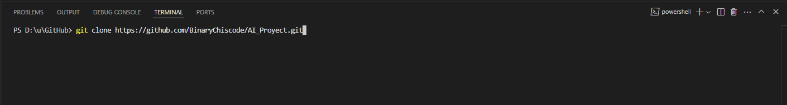
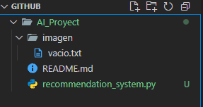
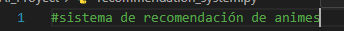
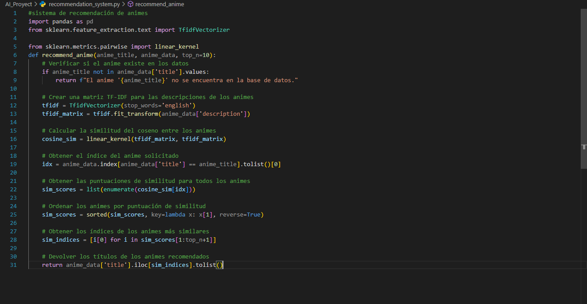

# AI_Proyect

Para poder realizar esta actividad formativa realice los siguientes pasos

Primero que nada cree mi cuenta en GitHub con el correo institucional

Luego de crear nuestra cuenta la configuré para usar GitHub Copilot en visual studio code

Luego de la configuración de la cuenta creamos nuestro repositorio

Una vez creado nuestro repositorio debemos de abrir nuestro Visual Studio Code

Una vez dentro abrimos una carpeta para trabajar en ella e importar el repositorio, en mi caso cree una carpeta llamada GitHub

Luego de abrir la carpeta entramos y abrimos una terminal y clonamos el repositorio con el codigo que se muestra

Una termina de clonar crearemos un archivo python donde ingresaremos el prompt de lo que queramos crear con ayuda de Copilot

Una vez creado, lo abriremos y escribiremos el prompt de lo que de un sistema para que Copilot nos ayude, en mi caso pediré un sistema de recomendaciones de animes

Y así el sistema de Copilot nos irá recomendando un códido en base a lo que le pedimos y solamente deberemos de presionar la tecla TAB para ir insertando el código que nos recomienda

